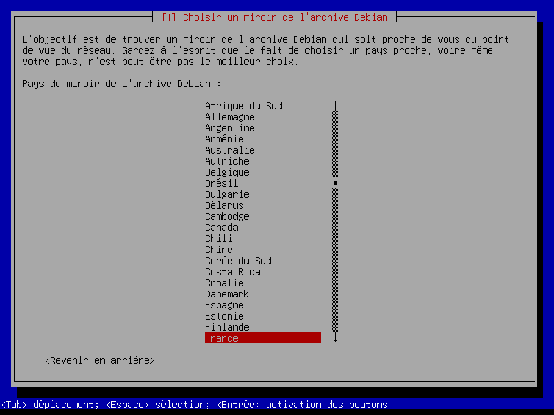

# [ LP LPW 2024 ] compte rendu TP1 UNIX :
DARRAS Loïc L3 PRO PROJET WEB ET MOBILE


# Présentation/Introduction du travail (avant la table des matières et les explications)

* L'objectif de ce travail pratique est d'explorer et de mettre en œuvre l'installation du système d'exploitation Debian 12 sur une machine virtuelle. Debian, en tant que distribution Linux, est réputé pour sa stabilité, sa sécurité et sa flexibilité, ce qui en fait un choix privilégié pour les serveurs, les environnements de développement et d'autres applications.

* Au cours de ce TP, nous aborderons les différentes étapes nécessaires à une installation réussie, allant du choix de la langue et de la configuration du clavier à la création des partitions et à la configuration du gestionnaire de démarrage GRUB. Nous mettrons également en lumière les commandes essentielles à connaître pour gérer efficacement le système après l'installation.

* L'utilisation de machines virtuelles nous permet de simuler un environnement de travail sans affecter notre système d'exploitation principal, offrant ainsi une opportunité d'apprentissage pratique dans un cadre sécurisé. Ce TP sera une occasion précieuse d'acquérir des compétences en administration système et de comprendre les fondements de l'installation et de la gestion d'un système Linux.

* Je tiens à préciser que j'ai eu des difficultés, notamment avec mes deux ordinateur personnels, en effet, le premier qui est un medion fonctionnant sous Windows 11 avec une version 32 bits ne permettait pas d'utiliser le fichier iso de Debian 12 demandé par le tp, cependant mon ordinateur hp fonctionnant sous Windows 11 avec une version 64 bits permettait donc d'utiliser ce fichier iso avec Oracle VirtualBox (sous sa dernière version).

* Malheureusement, j'ai vérifier les journaux d'installation grâce au shell et j'ai les messages d'erreurs suivants:


* Ici les messages indiquent qu'il y a des erreurs avec la configuration de quelques composants d'installation dans Debian, notamment avec **apt-setup-udeb** et **mktemp** . L'ISO est peut-être corrompue...


# Table des matières

1. [Partie 1 : Installation Machine virtuelle](#partie-1-installation-machine-virtuelle)
   - [I) Choisir la langue](#i-choisir-la-langue)
   - [II) Configurer le clavier](#ii-configurer-le-clavier)
   - [III) Configuration Réseaux (automatique)](#iii-configuration-réseaux-automatique)
   - [IV) Comptes utilisateurs](#iv-comptes-utilisateurs)
   - [V) La création des partitions](#v-la-création-des-partitions)
     - [A) La racine](#a-la-racine)
     - [B) espace tempo](#b-espace-tempo)
     - [C) Troisième partition : les logs](#c-troisième-partition-les-logs)
     - [D) swap (Quatrième partition)](#d-swap-quatrième-partition)
   - [VI) GRUB](#vi-grub)

2. [Partie 2 : Post-Installation](#partie-2-post-installation)
   - [A) Voici les commandes sur la VM](#a-voici-les-commandes-sur-la-vm)
   - [B) Voici le reste des commandes utilisées sur le terminal de Linux](#b-voici-le-reste-des-commandes-utilisé-sur-le-terminal-de-linux)


3. [3. Aller plus loin](#3-aller-plus-loin)
  - [3.1 Preseed : À quoi cela sert ?](#31-preseed-à-quoi-cela-sert)
  - [3.2 J’ai oublié mon mot de passe root, comment faire pour le changer ?](#32-jai-oublie-mon-mot-de-passe-root-comment-faire-pour-le-changer)
  - [3.3 Je souhaite redimensionner ma partition racine, comment puis-je faire sans réinstaller ?](#33-je-souhaite-redimensionner-ma-partition-racine-comment-puis-je-faire-sans-reinstaller)


4. [Conclusion finale](#conclusion-finale)


#  **Partie 1 : "Installation Machine virtuelle"**

## I) Choisir la langue

* Dans ce cas de figure, j'ai sélectionné **French - Français**


* Pour le choix de la situation géographique j'ai mis **"France"**


* Pour le choix des paramètres régionaux ("locales") j'ai sélectionné **"France - fr_FR.UTF-8"**


* Ensuite j'ai "fr_FR"


## II) Configurer le clavier

* J'ai ensuite mis la disposition de clavier à utiliser : **Français**


## III) Configuration Réseaux (automatique)


* J'ai donné un nom à mon système :  **’serveur1’**


* Ainsi qu'un nom de domaines : **ufr-info-p6.jussieu.fr**


* Je choisis un miroir d’installation : **http France standard**


* Voici quelques autres spécificités illustrant ce miroir :





## IV) Comptes utilisateurs


* J'ai activé la connexion de **compte super utilisateur (root)** pour ne pas créer de compte supplementaire.


## V) La création des partitions (la racine, espace tempo, les logs, ma swap) 


### A) La racine


* J'ai choisis **"début"** pour sélectionner **l'espace libre** sur le disque où je souhaite créer la partition

* Puis j'ai créé cette nouvelle partition


* Donc pour cette première partition j'ai définis la taille de **"10GB"** (10G comme demandé)


* J'ai bien nommé cette partition **"la racine"**


J"ai utilisé **'/'** pour que la partition soit utilisée comme la racine du système de fichiers


* J'ai donc choisi **ext4** comme type de système de fichiers (qui est souvent uitlisé pour les partitions sous Linux, ici DEBIAN 12)


* J'ai laissé le reste par défault, j'ai confirmé sa présence.
* Cette partition est importante car elle intègre le système d'exploitation et tous les fichiers nécessaires au fonctionnement de Debian.

### B) espace tempo

* J'ai choisis aussi **"début"** pour sélectionner l'espace libre sur le disque où je souhaite créer la partition.


* J'ai donc spécifié une taille de 4 GB comme demandé (4G)


* Donc pour le **point de montage**, j'ai entré **/tmp**, ce qui signifie que cette partition sera utilisé pou stocker des fichiers temporaires.


* J'ai aussi définis le nom demandé par le tp pour cette deuxième partition : **espace tempo**


* Sur l'image ci-dessus voici **le rendu final de cette deuxième partition** .


### C) Troisième partition : les logs


* J'ai donc définis une taille de **1GB** voir illustration final de cette partition plus bas .


* Donc pour le point de montage j'ai entré **/var**, cette partition sera utilisée pour stocker les journaux du système et d'autres fichiers variables.


* J'ai sélectionné donc encore **ext4** comme type de système de fichiers, qui est standard pour les partitions sous Linux.


* Voici ci-dessus le contenu final de cette troisième partition 


### D) swap (Quatrième partition)


* Donc je l'ai bien nommé **la swap** avec une utilisation d'espace d'échange ("swap")

### Résultat final pour les partitions


* Voici mon rendu final pour les partitions (ci-dessus)


## VI) GRUB


### Voici ce que j'ai fais pour GRUB :


* J'ai choisi le noyau correct 


* Ici, je n'ai pas exécuté **os-prober** car seul Debian est installé dans mon cas.

* En effet GRUB se chargera de démarrer directement Debian, sans avoir à vérifier s'il y a d'autres systèmes à gérer.


* J'ai installé le programme de démarrage **GRUB** sur le disque pirncipal lors de l'installation de Debian


* J'ai installé GRUB donc sur le disque principal **(/dev/sda)**
* C'est ce disque qui contient les partitions que j'ai configuré pour DEBIAN
* GRUB installera ici le programme de démarrage pour gérer le **boot du système**


#  **Partie 2 : "Post-Installation"**


* Je me suis donc connecté en root à ma VM avec l'iso DEBIAN 12 sur Oracle VirtualBox 

Pour cela j'ai utilisé **ssh root@10.20.0.179** avec comme mot de passe "**root**" .

* ssh correspond donc ici au programme utilisé pour établir la connexion sécurisée.
* root est ici le nom d'utilisateur administrateur sru les systèmes Unix/Linux, ayant tous les droits
* 10.20.0.179 : C'est l'adresse IP du serveur distant auquel je me suis connecté


### A) Voici les commandes sur la VM 


1. **dpkg -l**  
   **Description** : Cette commande permet d'afficher l'ensemble des paquets installés sur le système, ainsi que leur état respectif.  
   **Lien avec le TP** : Cruciale pour vérifier les paquets déjà présents, en particulier pour s'assurer que toutes les dépendances nécessaires aux services ou applications sont installées.

2. **df -h**  
   **Description** : Fournit une vue d'ensemble de l'utilisation de l'espace disque sur les systèmes de fichiers montés, avec des unités lisibles (comme G pour gigaoctets).  
   **Lien avec le TP** : Essentiel pour évaluer l'espace libre avant d'installer de nouveaux paquets ou services, évitant ainsi des problèmes de saturation.

3. **halt -p**  
   **Description** : Arrête le système de manière sécurisée, en coupant l'alimentation si cela est possible.  
   **Lien avec le TP** : Utile lors de la maintenance du système ou lorsque j'ai besoin de redémarrer le serveur après des modifications.

4. **nano sshd_config**  
   **Description** : Lance l'éditeur de texte nano pour modifier le fichier `sshd_config`, qui configure les paramètres du serveur SSH (Secure Shell).  
   **Lien avec le TP** : Permet d'ajuster les paramètres de sécurité pour SSH, incluant les ports, les utilisateurs autorisés, et d'autres options de connexion.

5. **nano /etc/ssh/sshd_config**  
   **Description** : Semblable à la commande précédente, elle ouvre directement le fichier de configuration SSH dans le répertoire `/etc/ssh/`.  
   **Lien avec le TP** : Modification directe des paramètres de configuration SSH, cruciale pour la gestion à distance du serveur.

6. **halt**  
   **Description** : Arrête le système sans option de coupure d'alimentation, ce qui pourrait être risqué si des processus critiques sont en cours.  
   **Lien avec le TP** : Utilisé pour tester l'arrêt du système, mais à manipuler avec précaution pour éviter toute perte de données.

7. **history**  
   **Description** : Affiche l'historique des commandes précédemment exécutées dans le terminal.  
   **Lien avec le TP** : Pratique pour réviser/revoir les commandes exécutées ou pour retrouver une commande que je souhaite relancer.

8. **apt update**  
   **Description** : Met à jour la liste des paquets disponibles et leurs versions à partir des dépôts configurés.  
   **Lien avec le TP** : Indispensable avant d’installer ou de mettre à jour des paquets, garantissant que je dispose des dernières versions.

9. **apt search openssh-server**  
   **Description** : Recherche des paquets contenant "openssh-server" dans leur nom ou leur description.  
   **Lien avec le TP** : Utile pour identifier le paquet SSH à installer et vérifier sa disponibilité dans les dépôts.

10. **apt install**  
    **Description** : Permet l'installation d'un paquet. Généralement, je devrai spécifier le nom du paquet après cette commande.  
    **Lien avec le TP** : Employée pour installer les logiciels requis, tels que SSH.

11. **apt install openssh-server**  
    **Description** : Installe le paquet `openssh-server`, essentiel pour configurer un serveur SSH sur Debian.  
    **Lien avec le TP** : Indispensable pour établir une connexion sécurisée à distance avec mon serveur.


13. **ssh root@10.20.0.179**  
    **Description** : Tente d’établir une connexion SSH avec le serveur à l'adresse IP 10.20.0.179 en utilisant l'utilisateur root.  
    **Lien avec le TP** : Permet de tester la connexion au serveur SSH que je viens de configurer.

14. **systemctl restart ssh**  
    **Description** : Redémarre le service SSH sur le système.  
    **Lien avec le TP** : Nécessaire après des modifications apportées à la configuration de SSH pour que celles-ci prennent effet.


### B) Voici le reste des commandes utilisé sur le terminal de Linux :

#### **1. dpkg -l | wc -l :**
```bash
root@serveur-correction:~# dpkg -l | wc -l
330
```

**dpkg -l :** Liste tous les paquets installés sur notre système avec leurs statuts.

**| wc -l** : Ici notre commande prend pour valeur la sortie de la commande précédente et compte en conséquence le nombre de lignes. Ici, il y a 330 lignes, donc 330 paquets installés.


#### **2. df -h :** 


```bash
root@serveur-correction:~# df -h
Sys. de fichiers Taille Utilisé Dispo Uti% Monté sur
udev               4,9G       0  4,9G   0% /dev
tmpfs              995M    572K  994M   1% /run
/dev/sda1          9,1G    1,6G  7,0G  19% /
tmpfs              4,9G       0  4,9G   0% /dev/shm
tmpfs              5,0M       0  5,0M   0% /run/lock
/dev/sda3          921M     23M  835M   3% /var/log
/dev/sda2          3,6G     40K  3,4G   1% /tmp
tmpfs              995M       0  995M   0% /run/user/0
```


df : Montre l’espace du disque utilisé et l'espace qui est disponible sur les systèmes de fichiers montés.

-h : Ici on formate (transforme) la sortie en **« human-readable »** (plus compréhensible, mieux lisible pour les humains), avec des unités comme G (gigaoctets) ou M (mégaoctets).

---

Exemple de sortie :

* /dev/sda1 : Partion principale, elle utilise 1,6 Go sur 9,1 Go, soit 19%.
* /dev/sda3 : Partition dédiée aux logs avec 23 Mo utilisés sur 921 Mo.
* /dev/sda2 : Partition temporaire, quasiment vide avec 40 Ko utilisés sur 3,6 Go.

---
#### **3. echo $LANG**

```bash
root@serveur-correction:~# echo $LANG
fr_FR.UTF-8
```


* Dans cette situation, notre commande affiche la variable d'environnement **$LANG** qui permet de connaître la langue utilisée ainsi que les paramètres régionaux de notre système. Ici c'est **"français, format UTF-8"** correspondant à **fr_FR.UTF-8**

#### **4. hostname**

```bash
root@serveur-correction:~# hostname
serveur-correction
```

* Affiche le nom de l'hôte de la machine. Dans ma situation c'est **"serveur-correction"**

#### **5. cat /etc/apt/sources.list | grep -v -E '^#|^$'**

```bash
root@serveur-correction:~# cat /etc/apt/sources.list | grep -v -E '^#|^$'
deb http://deb.debian.org/debian/ bookworm main contrib non-free non-free-firmware
deb http://security.debian.org/debian-security bookworm-security main contrib non-free non-free-firmware
deb http://deb.debian.org/debian/ bookworm-updates main contrib non-free non-free-firmware
```

* **(cat /etc/apt/sources.list)** Ici j'affiche le contenu du fichier **sources.list** qui contient les dépôts dont APT utilise pour télécharger et mettre à jour nos paquets
* **(grep -v -E '^#|^$')** Filtre les lignes qu ne sont ni de commentaires (qui commencent par #) ni vides. Cela montre donc uniquement les lignes actives (URL des dépôts) .

#### **6. cat /etc/shadow | grep -vE ':\*:|:!\*:'**

```bash
root@serveur-correction:~# cat /etc/shadow | grep -vE ':\*:|:!\*:'
root:$y$j9T$cGKpM0Fh8WZYM4MlsbdWz0$hO26Ub/deBLYO3CleXEevZ8v/V.ItKMLsZ274x5BMtA:19635:0:99999:7:::
messagebus:!:19635::::::
sshd:!:19998::::::
```

* **(cat /etc/shadow)** Ceci affiche donc le fichier des mots de passe chiffrés des utilisateurs
* (**grep -vE ':\*:|:!\*:'** ) Donc là on filtre les lignes ne contenant pas les caractères * ou **!***
(qui désignent en conséquence des comptes désactivés)


#### **7. cat /etc/passwd | grep -vE 'nologin|sync'**

```bash
root@serveur-correction:~# cat /etc/passwd | grep -vE 'nologin|sync'
root:x:0:0:root:/root:/bin/bash


```

* **(cat /etc/passwd)** Ceci montre la liste des utilisateurs et des informations qui les concernent.

* **grep -vE 'nologin|sync'** ; Ici je filtre, je trie, les comptes qui ne peuvent pas se connecter, tels que ceux avec le shell **nologin** ou **sync** .


#### **8. fdisk -l**

```bash
root@serveur-correction:~# fdisk -1
fdisk : option invalide -- '1'
Exécutez « fdisk --help » pour obtenir des renseignements complémentaires.
```

* fdisk : Utilisé pour manipuler les tables de partition.

* -l : Ceci liste toutes les partitions disponibles sur les disques. Ici, on montre les informations sur les partitions du disque **/dev/sda**.


#### **9. fdisk -x**

```bash
root@serveur-correction:~# fdisk -x
Disque /dev/sda : 20 GiB, 21474836480 octets, 41943040 secteurs
Modèle de disque : HARDDISK        
Unités : secteur de 1 × 512 = 512 octets
Taille de secteur (logique / physique) : 512 octets / 512 octets
taille d'E/S (minimale / optimale) : 512 octets / 512 octets
Type d'étiquette de disque : gpt
Identifiant de disque: 3ED2EBFD-8995-4690-8EEF-8C65108F2339
Premier LBA utilisable: 34
Dernier LBA utilisable: 41943006
LBA alternatif: 41943039
LBA de départ des entrées de partition: 2
Entrées de partitions allouées: 128
LBA de fin des entrées de partition: 33

Périphérique    Début      Fin Secteurs Type-UUID                            UUID                                 Nom Attr.
/dev/sda1        2048 19531775 19529728 0FC63DAF-8483-4772-8E79-3D69D8477DE4 7202EEDF-B999-47CC-BE80-70C80C2C83B0 la racine
                                                                                                                     
/dev/sda2    19531776 27344895  7813120 0FC63DAF-8483-4772-8E79-3D69D8477DE4 346085A8-A5AE-48BA-B6B7-BDA598DD7465 espace tempo
                                                                                                                     
/dev/sda3    27344896 29298687  1953792 0FC63DAF-8483-4772-8E79-3D69D8477DE4 8F880167-DE17-4896-BB95-EE5AAC9E2E9A les logs
                                                                                                                     
/dev/sda4    29298688 41940991 12642304 0657FD6D-A4AB-43C4-84E5-0933C84B4F4F 68C18C76-59A6-45DF-A745-F87FD1D412DA ma swap
```

* Ceci affiche des détails supplémentaires sur les partitions (identifiants UUID , les attributs spécifiques ....)


# 3. Aller plus loin

> J'ai bien cherché sur le net ;)

### 3.1 Preseed : À quoi cela sert ?

## Source
- [Preseed pour debian](https://angoule.me/lit/linux-et-TCPIP/preseed-pour-debian)


Selon https://angoule.me/ (https://angoule.me/lit/linux-et-TCPIP/preseed-pour-debian), un article datant du jeudi 17 mars 2016, écrit par GuiLux,  **preseed** est un mécanisme qui permet d’appliquer des paramètres sans interaction utilisateur lors de l’installation debian / ubuntu.

C’est hautement personnalisable, simple à intégrer. D’autres lui préfèrent kickstart, plus récent.

Preseed repose sur un simple fichier texte, appelé par l’installeur debian. On y inscrit les réponses voulues aux questions posées par l’installeur. Les fichiers preseed peuvent être servis en TFTP ou HTTP. Dans un souci d’optimisation et de simplicité, on verra la méthode TFTP.

### 3.2 J’ai oublié mon mot de passe root, comment faire pour le changer ?


## Source
- [Réinitialiser le mot de passe root perdu ou oublié Ubuntu](https://www.malekal.com/reinitialiser-le-mot-de-passe-root-perdu-ou-oublie-ubuntu/)

Lorsque le mot de passe root ou administrateur est perdu sur Ubuntu, deux méthodes principales permettent de le réinitialiser : **le mode rescue** ou **un live USB**.


## Méthode 1 : Via le mode rescue

1. **Démarrer en mode rescue** :
   - Redémarrer l'ordinateur et appuyer sur `Maj` ou `ESC` pendant le démarrage.
   - Sélectionner **Options avancées** puis **Mode recovery**.

2. **Accéder au shell root** :
   - Dans le menu, sélectionner l'option **root**.

3. **Réinitialiser le mot de passe** :
   - Utiliser la commande :
     ```bash
     passwd nomutilisateur
     ```

4. **Sortir du mode rescue** :
   - Taper `exit`, puis sélectionner **Resume** pour démarrer normalement.

## Méthode 2 : Via un live USB

1. **Créer un Live USB** :
   - Télécharger l'ISO d'Ubuntu et démarrer le PC sur la clé.

2. **Monter la partition système** :
   - Lister les partitions avec :
     ```bash
     sudo fdisk -l
     ```
   - Monter la partition avec :
     ```bash
     mkdir /tmp/sda1
     sudo mount /dev/sda1 /tmp/sda1
     ```

3. **Accéder au système monté** :
   - Utiliser la commande :
     ```bash
     sudo chroot /tmp/sda1 /bin/bash
     ```

4. **Changer le mot de passe** :
   - Utiliser la commande :
     ```bash
     passwd nomutilisateur
     ```

## Conclusion
Ces deux méthodes permettent de réinitialiser le mot de passe root ou administrateur sur Ubuntu en cas d'oubli.


### 3.3 **Je souhaite redimensionner ma partition racine, comment puis-je faire sans réinstaller ?**  
# Linux : Redimensionner (Agrandir/Réduire) une Partition

## Source
- [Linux : redimensionner (agrandir/réduire) une partition](https://lecrabeinfo.net/redimensionner-agrandir-reduire-une-partition-sur-linux.html#:~:text=Pour%20ce%20faire%2C%20s%C3%A9lectionnez%20la,m%C3%AAme%20pour%20les%20partitions%20restantes.)

Ce tutoriel explique comment redimensionner une partition sur Linux en utilisant **GParted** ou l'outil en ligne de commande **fdisk**.

## Table des Matières pour cette question
- Redimensionnement avec GParted
- Redimensionnement avec fdisk

## Redimensionner avec GParted

1. **Installer GParted** :  
   Il faut exécuter `sudo apt install gparted` pour installer le logiciel.
   
2. **Ouvrir GParted** et identifier la partition que je souhaite redimensionner. Dans ce tutoriel, la partition `/dev/nvme0n1p4` sera agrandie en utilisant **454,57 Go** d'espace non alloué.

3. **Déplacer les partitions** situées à droite de la partition que je souhaite redimensionner. Je fais un clic droit sur la partition à déplacer et je sélectionne **Redimensionner/Déplacer**.

4. **Redimensionner la partition** à la taille désirée. Je fais un clic droit sur la partition, je sélectionne **Redimensionner/Déplacer** et je fais glisser pour ajuster la taille.

5. **Appliquer les modifications** en cliquant sur le bouton **Appliquer** pour finaliser le redimensionnement.

### Félicitations ! Vous avez réussi à redimensionner votre partition avec GParted !

---

## Redimensionner avec fdisk

1. **Ouvrir le terminal** et identifier la partition que je souhaite redimensionner en utilisant :
   ```bash
   lsblk -f
   ```

2. **Démonter la partition** :
   ```bash
   umount /dev/nvme0n1p4
   ```

3. **Ouvrir fdisk** :
   ```bash
   sudo fdisk /dev/nvme0n1
   ```

4. **Supprimer la partition** que je souhaite redimensionner (cela ne supprime pas les données, mais seulement la disposition de la partition) :
   ```bash
   d
   ```

5. **Créer une nouvelle partition** avec la taille souhaitée :
   ```bash
   n
   ```

6. **Écrire la nouvelle table de partitions** sur le disque :
   ```bash
   w
   ```

7. **Vérifier le système de fichiers** de la partition redimensionnée :
   ```bash
   e2fsck -f /dev/nvme0n1p4
   ```

8. **Redimensionner le système de fichiers** pour qu'il corresponde à la nouvelle taille de la partition :
   ```bash
   resize2fs /dev/nvme0n1p4
   ```

9. **Monter la partition** :
   ```bash
   mount /dev/nvme0n1p4

  
   ```

### Félicitations ! Vous avez réussi à redimensionner avec fdisk !

### Conclusion finale

Ce TP a été une expérience d'apprentissage, bien que j'aie rencontré plusieurs difficultés tout au long du processus. Malgré ces obstacles, j'ai pu acquérir des compétences essentielles en gestion de systèmes, en particulier dans l'installation et la configuration d'un serveur SSH sur Debian.

L'utilisation de commandes comme `dpkg`, `apt`, et `systemctl` m'a permis de comprendre comment gérer les paquets et les services sur un système Linux. Cependant, j'ai également constaté des lacunes dans ma compréhension de certains concepts, ce qui a rendu certaines tâches plus difficiles que prévu. Peut-être dû à un BTS SIO, spécialisé dans le développement (SLAM), qui néglige certains éléments essentiels du réseau.

À l'avenir, je m'engage à :
- **Améliorer ma documentation** : Je vais prendre le temps de bien documenter mes démarches pour éviter de perdre des informations cruciales.
- **M'approfondir dans la recherche** : Je vais consacrer plus de temps à comprendre n'importe quelle commande et son impact sur le système, ce qui m'aidera à mieux anticiper les problèmes potentiels.
- **Pratiquer davantage** : La pratique relativement régulière de ces commandes et concepts me permettra sûrement de gagner en confiance et en compétence.

* Bien que ce TP ne s'est pas terminé sur un **"happy end"**, il a été riche en enseignements et m’a fourni une base solide pour mes futurs travaux pratiques. Je suis déterminé à tirer parti de cette expérience pour m'améliorer et mieux préparer mes prochaines missions.

 * De plus, je trouve l'approche **'Systèmes/Services Unix'** très intéressante. Au départ, j'appréhendais cette matière et maintenant j'en ai un petit aperçu positif, en espérant que je m'adapterai mieux au prochain TP !


